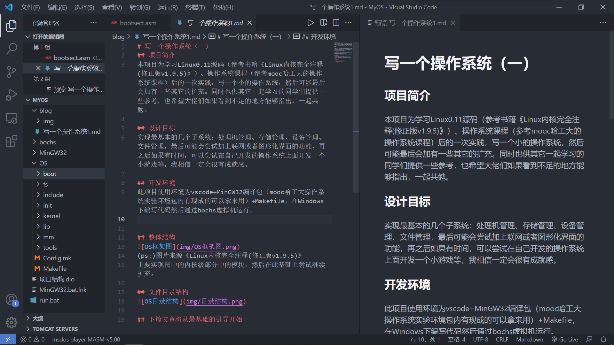
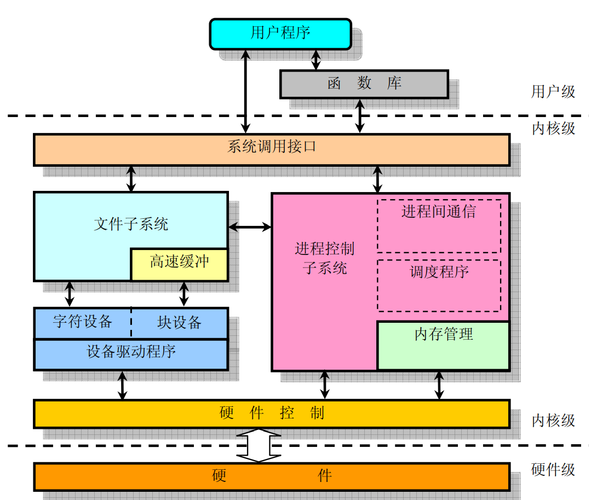
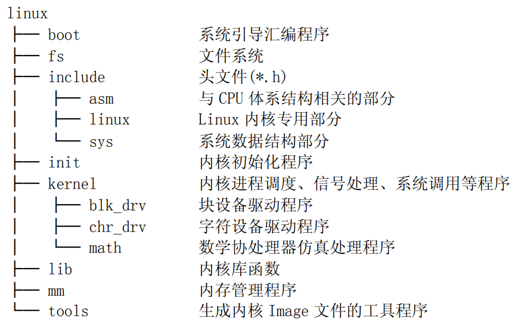

# 写一个操作系统（一）
## 项目简介
本项目为学习Linux0.11源码（参考书籍《Linux内核完全注释(修正版v1.9.5)》）、操作系统课程（参考mooc哈工大的操作系统课程）后的一次实践，写一个小的操作系统，然后可能最后会加有一些其它的扩充。同时也供其它一起学习的同学们提供一些参考，也希望大佬们如果看到不足的地方能够指出，一起共勉。

## 设计目标
最基本的几个子系统：处理机管理、存储管理、设备管理、文件管理，实现一个能够完整运行的简单操作系统，最后可能会尝试加上联网或者图形化界面的功能，再之后如果有时间，可以尝试在自己开发的操作系统上面开发一个小游戏等，我相信一定会很有成就感。

## 开发环境
此项目使用环境为vscode+MinGW32编译包（mooc哈工大操作系统实验环境包内有现成的可以拿来用）+Makefile，在Windows下编写代码然后通过bochs虚拟机运行。

## 整体结构

(ps:)图片来源《Linux内核完全注释(修正版v1.9.5)》  
主要实现图中的内核级部分中的模块，然后在此基础上尝试继续扩充。  

## 文件目录结构

## 下篇文章将从最基础的引导开始